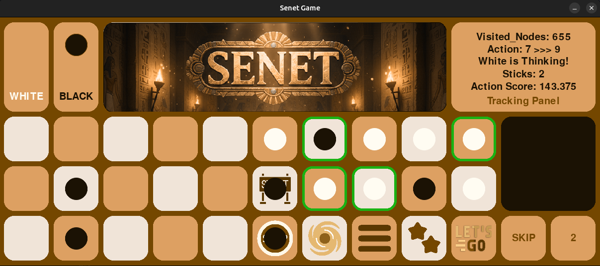

# Senet Gameplay: Intelligent Search Algorithms

A Python/Pygame implementation of **Senet** — one of the world's oldest board games — featuring an AI opponent powered by the **Expectiminimax** search algorithm.

An intelligent-search algorithms course project (fourth-year team). It demonstrates adversarial and non-deterministic search in a playable, interactive game with a custom GUI.

## Features

- **4 game modes** — Human vs Human, Algorithm vs Algorithm, Algorithm vs Human, Algorithm vs Random agent.
- **Expectiminimax AI** — depth-limited search (default depth 2) over MAX/MIN and TOSS (chance) nodes.
- **AI tracking panel** — live display of action score, chosen action, stick value, and visited nodes.
- **Interactive UI** — mouse-driven controls, TOSS/SKIP buttons, legal-move highlights, undo (Z), restart (R), and sound effects.

## Screenshots



## Game Rules

- **Board**: 30 squares (positions `1–30`) in an S-shaped path; position `0` is the goal.
- **Pawns**: 7 per player — Black starts on `{2,4,6,8,10,12,14}`, White on `{1,3,5,7,9,11,13}`.
- **Stick toss**: four sticks; a toss of `0` maps to 5. Distribution: 5→1/16, 1→4/16, 2→6/16, 3→4/16, 4→1/16.
- **Movement**: move a pawn forward by the tossed value; can't land on a same-color pawn or move past square 30.
- **Special houses**:
  - **26** House of Happiness (stop) — landing past it may be blocked.
  - **27** House of Water — pawn is sent back to the first free square below 15.
  - **28/29** Houses of Three/Two — must land with an exact toss of 3/2, otherwise the pawn is pulled back below 15.
  - **30** House of Re-Atoum (go) — a pawn here may leave the board on any roll.
- Landing on an opponent's pawn swaps it back to your starting square.
- **Win**: first player to move all 7 pawns off the board.

## Installation

Requires Python 3 and `pygame == 2.6.1`:

```bash
pip install -r requirements.txt
```

## Usage

Run from the project root with one argument:

| Command | Description |
|---|---|
| `python ./main.py player_mode` | Player vs Player |
| `python ./main.py algorithm_mode` | Algorithm vs Algorithm |
| `python ./main.py algorithm_and_player_mode` | Algorithm (Black) vs Player (White) |
| `python ./main.py algorithm_and_random_mode` | Algorithm (Black) vs Random agent (White) |

Controls: click the **TOSS** square (31) to toss sticks, click a **highlighted pawn** to move, click **SKIP** (0) to skip a turn. **Z** = undo, **R** = restart, **ESC** = quit.

## Project Structure

```
├── main.py                  # Entry point: parses CLI mode, launches the game
├── game.py                  # Game class, main loop, mode selection, undo/restart
├── game_state.py            # State model: pawn positions, turn, sticks, parent
├── game_engine.py           # Rules: transitions, valid actions, probabilistic stick toss
├── algorithms/algorithm.py  # ExpectiMinimaxPlayer: Expectiminimax search + heuristic
├── modes/                   # player_mode, algo_mode, algo_player_mode, algo_random_mode
├── game_renderer/renderer.py# Pygame UI: board, pawns, panels, buttons, tracking
├── audio/                   # move.wav, toss.mp3, wow.mp3
└── images/                  # Board elements, titles, logos, special-house sprites
```

- **`game_state.py`** — `PlayerColor` and `State` (white/black positions, current player, sticks, `parent` for undo).
- **`game_engine.py`** — `transition_model()`, `actions()`, `TossStick()`, and `handle_special_houses()`.
- **`modes/`** — thin controllers implementing the `processInput`/`update`/`render` contract.
- **`game_renderer/renderer.py`** — all drawing logic and the AI tracking panel.

## The Search Algorithm

**Expectiminimax** generalizes Minimax for games with chance nodes:

- **MAX** (Black) picks the highest-value move; **MIN** (White) the lowest.
- **TOSS** chance nodes branch over all stick values, weighted by probability (1→4/16, 2→6/16, 3→4/16, 4→1/16, 5→1/16).
- The search is depth-limited (depth 2), terminating at depth 0 or a terminal state, and plays optimally from either side (MAX root vs MIN root).

**Heuristic evaluation** (from Black's perspective, `black − white`), per remaining pawn:

| Pawn location | Score |
|---|---|
| House of Water (27) | −50 |
| House of Happiness (26) | +40 |
| House of Three (28) | −30 |
| House of Two (29) | −20 |
| Any other square | + square index |

Pawns off the board add `+100` each. Terminal states: Black win `+10000`, White win `−10000`. The −20/−30 penalties bias the search away from the pull-back houses 28/29.

Each search records `visited_nodes` and the root action `score`, shown live in the tracking panel.

---

*Senet — the game of passing, from ancient Egypt, now with Expectiminimax.*
